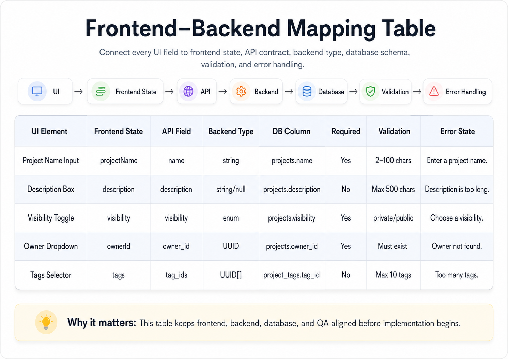

# Frontend–Backend Mapping Table

## Definition

A table that maps every visible UI element to frontend state, API field, backend type, database column, validation rule, and error state.

## Mental Model

A field-to-backend mapping is the wiring diagram between product design and software architecture.

## Example

| UI Element | Frontend State | API Field | Backend Type | DB Column | Required | Validation | Error State |
|---|---|---|---|---|---|---|---|
| Project Name Input | projectName | name | string | projects.name | Yes | 2–100 chars | Enter a project name. |
| Description Box | description | description | string/null | projects.description | No | Max 500 chars | Description is too long. |
| Visibility Toggle | visibility | visibility | enum | projects.visibility | Yes | private/public | Choose a visibility. |
| Owner Dropdown | ownerId | owner_id | UUID | projects.owner_id | Yes | Must exist | Owner not found. |
| Tags Selector | tags | tag_ids | UUID[] | project_tags.tag_id | No | Max 10 tags | Too many tags. |

## Graphic

## Why It Matters

This table keeps frontend, backend, database, and QA aligned before implementation begins.
